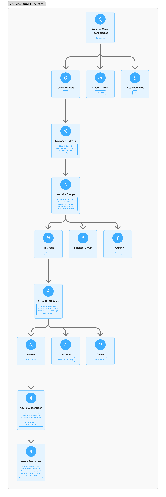
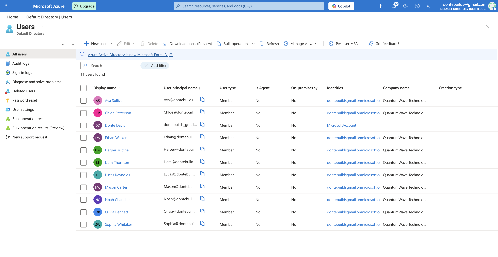
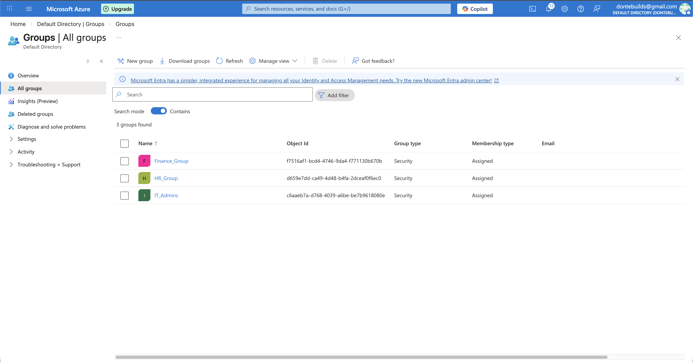
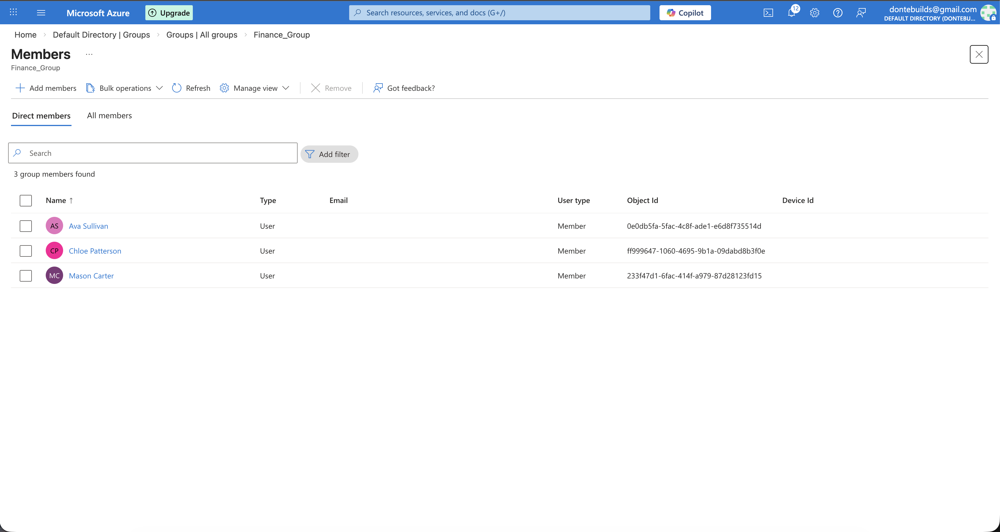
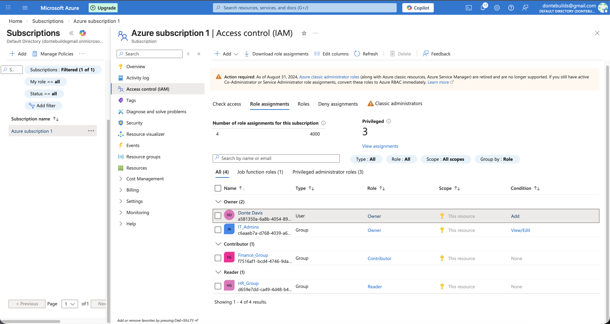
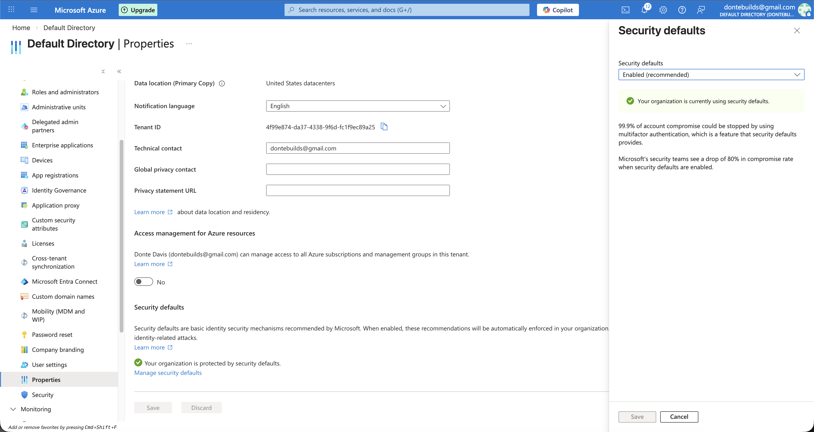
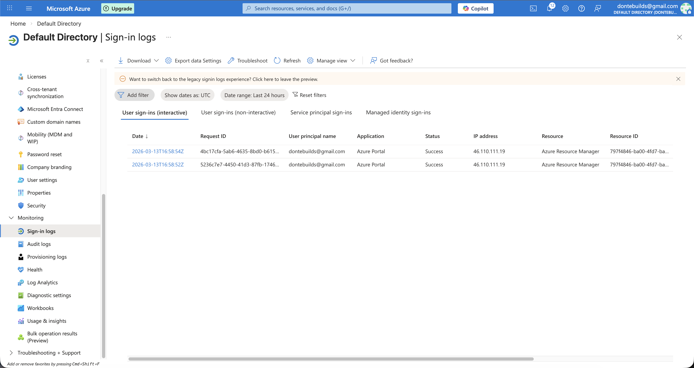

# Cloud Identity & Access Management Lab (Microsoft Entra ID)

Project Type: Cloud Security / Identity & Access Management Lab

## Overview

This project demonstrates the deployment and configuration of a cloud-based identity and access management environment using Microsoft Entra ID within Microsoft Azure.

The lab simulates a mid-size organization migrating to a cloud identity platform and focuses on core IAM capabilities including user lifecycle management, role-based access control, and identity security monitoring.

Project scope: The lab environment includes 10 simulated users across three departments with role-based access assigned through security groups.

---

## Simulated Organization

Organization: QuantumWave Technologies

Industry: Software Development

Employees: 500

Departments Included in Lab Environment

• Human Resources  
• Finance  
• IT Operations

The organization is migrating identity management from an on-premises directory to a cloud-based solution using Microsoft Entra ID.

---

## Objectives

• Deploy a cloud identity environment using Microsoft Entra ID  
• Create and manage organizational users and groups  
• Implement Role-Based Access Control (RBAC)  
• Configure identity security protections  
• Monitor authentication activity using sign-in logs

---

## Technologies Used

Microsoft Azure  
Microsoft Entra ID  
Azure Role-Based Access Control (RBAC)

---

## Environment Architecture

The identity environment consists of multiple departments with users assigned to security groups. Access to Azure resources is controlled through RBAC policies applied at the subscription level.

Identity Access Flow:

Users → Security Groups → RBAC Roles → Azure Resources

---

## Architecture Diagram

The following diagram illustrates how users authenticate through Microsoft Entra ID and receive access to Azure resources through security groups and RBAC roles.

---

## User Management

Users were created to represent employees across departments.

Example users:

| User           | Department |
| -------------- | ---------- |
| Olivia Bennett | HR         |
| Mason Carter   | Finance    |
| Lucas Reynolds | IT         |

User lifecycle management was simulated by assigning users to appropriate department groups.

---

### Example User Directory

---

## Group Management

Security groups were created to manage department-level access.

| Group Name    | Purpose                  |
| ------------- | ------------------------ |
| HR_Group      | Human resources access   |
| Finance_Group | Financial systems access |
| IT_Admins     | Administrative access    |

These groups allow centralized management of permissions.

## Group Membership

Users were assigned to groups based on their department responsibilities.

---

## Role-Based Access Control (RBAC)

RBAC was configured at the Azure subscription level.

| Group         | Assigned Role |
| ------------- | ------------- |
| HR_Group      | Reader        |
| Finance_Group | Contributor   |
| IT_Admins     | Owner         |

This configuration demonstrates the principle of least privilege by assigning roles based on departmental responsibilities rather than individual user permissions.

---

## Identity Security Controls

Security protections were implemented to improve authentication security.

Controls include:

• Multi-factor authentication through Security Defaults  
• Modern authentication enforcement  
• Identity monitoring using Entra ID sign-in logs

These protections help mitigate risks such as credential compromise.

---

## Sign-In Log Monitoring

Authentication activity was reviewed through Entra ID sign-in logs.

Monitoring includes:

• User login attempts  
• Authentication method used  
• Source IP addresses  
• Sign-in success or failure

These logs help security teams detect suspicious login activity.

---

## Security Considerations

During the configuration of the identity environment, several security best practices were implemented to reduce the risk of unauthorized access.

Key considerations included:

• Implementing multi-factor authentication through Entra ID Security Defaults  
• Applying Role-Based Access Control (RBAC) using the principle of least privilege  
• Managing permissions through security groups rather than individual user assignments  
• Monitoring authentication activity through Entra ID sign-in logs

These controls help protect cloud identity infrastructure from common threats such as credential compromise and unauthorized privilege escalation.

---

## Key Security Concepts Demonstrated

Identity and Access Management  
Role-Based Access Control  
Principle of Least Privilege  
Cloud Identity Security  
Authentication Monitoring

---

## Lessons Learned

This project provided hands-on experience configuring identity infrastructure within a cloud environment using Microsoft Entra ID.

During the lab, I implemented user provisioning, security group management, and RBAC role assignments to simulate how organizations manage access to cloud resources.

The exercise also reinforced how identity configuration plays a critical role in cloud security and how controls such as multi-factor authentication, RBAC, and authentication monitoring help reduce the risk of unauthorized access.

---

## Future Improvements

If implemented in a production environment, additional identity protections could include:

• Conditional Access policies to restrict login locations and device compliance  
• Privileged Identity Management (PIM) for temporary administrative access  
• Identity Protection policies to detect risky sign-in behavior  
• Centralized log ingestion into a SIEM platform for monitoring and alerting
